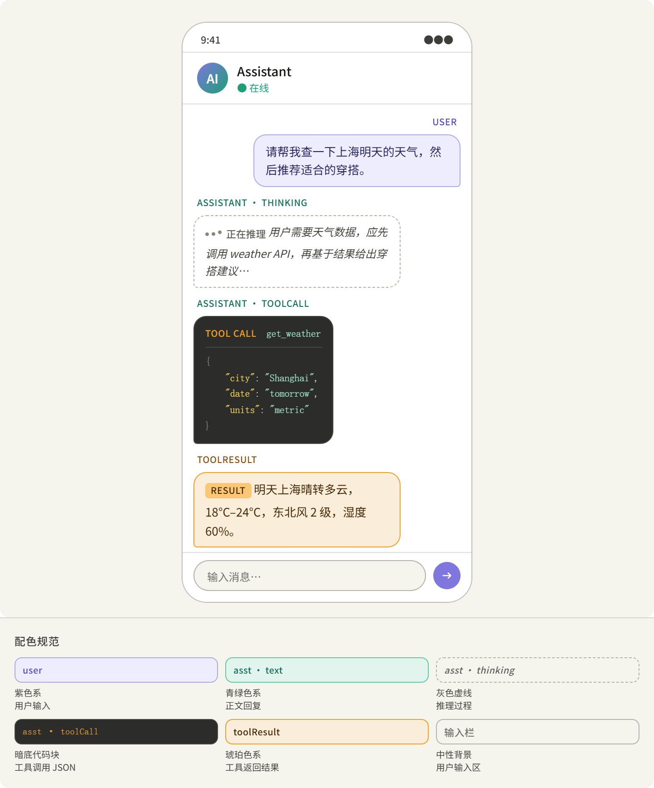
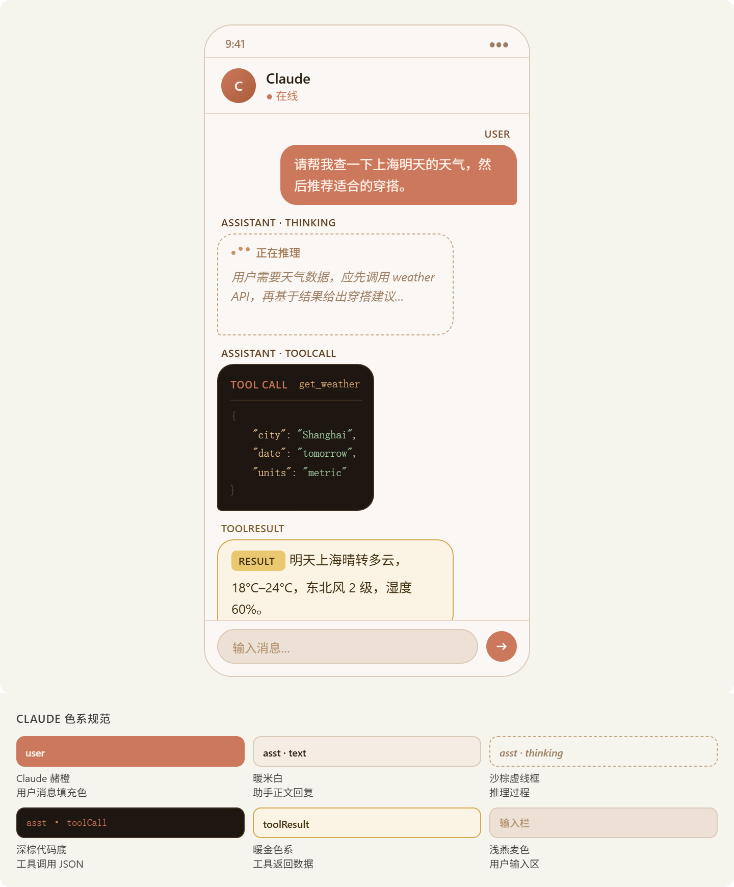

# Chat 页对话气泡配色（色系设计说明）

## 1. 文档定位

本文档描述聊天页各套**气泡与内容块色系**的设计意图、角色与 `partType` 的色彩逻辑，以及与客户端 `ChatPageThemeKind` 的对应关系。阅读对象：产品与界面实现；实现入口为 `ChatPageTheme.kt` 中 `chatBubbleThemeTokens` 各分支。

当前提供 **3** 套互斥方案，每种色系独占一节（二级标题 `##`），与枚举**一一对应**：

| 枚举名 | 界面 label |
| --- | --- |
| `LegacyBlue` | 经典蓝韵 |
| `SemanticViolet` | 语义紫青 |
| `WarmStudio` | 燕麦赭韵 |

---

## 2. 经典蓝韵（`LegacyBlue`）

### 2.1 设计定位

本套为应用**默认经典色系**：以客户端全局**主色蓝调**为轴，对用户气泡、助手气泡及各类 `part` 卡片做**同色相内的柔和插值（lerp）**，与 `mobileAccent`、`mobileSurface`、`mobileBorder` 等语义色对齐。整体追求**统一、低刺激对比**，适合作为长期默认的「跟手主题色」路线，也属于文档中所称的**经典色系**基线——不强调多角色跳色，而强调与全站蓝绿体系的**一体感**。

### 2.2 色彩与层级逻辑

- **用户 / 助手**：在蓝青家族内区分明度与饱和度，避免与主界面导航、按钮色脱节。
- **partType**：与其它套系共用同一套**形态语义**——`text` 为实心气泡、`thinking` 为虚线推理框、`toolCall` 为深色代码底、`toolResult` 为独立强调色块；本套主要在**色相与对比度曲线**上与「语义紫青」「燕麦赭韵」拉开差异，而非重新定义结构。

### 2.3 形态与实现约定

- **形态**：由 `partType` 决定实心、虚线推理框、深色 toolCall 底等，与紫青套、赭暖套一致。
- **实现**：`ChatPageTheme.kt` 内 `chatBubbleThemeTokens` 的 `LegacyBlue` 分支（圆角气泡默认对称 12dp，composer 沿用通用 `mobile*` 配色）。

---

## 3. 语义紫青（`SemanticViolet`）

### 3.1 设计定位

本套采用**强语义分区**策略：**用户紫、助手正文青绿、工具结果琥珀**，与 `toolCall` 暗色块形成清晰层级，属于**多角色、多色系并列**的路线；与经典蓝韵的「单轴渐变」形成对照，适合希望**一眼分辨说话者与内容类型**的场景。

### 3.2 颜色选择原则

**原则：角色 → 色系，`partType` → 形态。**

每种 role 绑定专属色调，`partType` 只改变气泡的**形态**（实心 / 虚线 / 深色代码块），不改变「这条是谁的、属于哪类内容」的色彩归属，从而降低认知负荷。

### 3.3 角色与色系

| Role | 色系 | 选用原因 |
| --- | --- | --- |
| user | 紫色（#EEEDFE / #534AB7） | 主动发起，紫色带有「意图」感，与靠右对齐习惯一致 |
| assistant · text | 青绿色（#E1F5EE / #0F6E56） | 自然、可信，回复类内容的经典语义色 |
| assistant · thinking | 灰色虚线边框 + 斜体 | 视觉降级，暗示中间过程而非最终结论 |
| assistant · toolCall | 深色代码底（#2C2C2A） | 工具调用为结构化数据，延续编辑器暗色惯例，与文字气泡强区分 |
| toolResult | 琥珀色（#FAEEDA / #EF9F27） | 外部数据回传，琥珀偏黄暖，与 toolCall 深色形成呼应 |

### 3.4 示意图



### 3.5 细节设计要点

1. **气泡尾角**：user 右下圆角收小（4px），assistant / toolResult 左下收小，符合主流 IM 习惯。
2. **toolCall 内语法高亮**：JSON key 亮黄、string 青绿、数字浅橙、boolean 粉色，便于扫读。
3. **thinking**：动态省略点（三圆点 bounce），强化「进行中」感知。
4. **role-label 微标签**：气泡组上方极小分类标签（10px 大写），便于调试；上线后可隐藏。
5. **深浅模式**：正文走语义色变量，深色模式可适配；代码块固定深色，不随模式反转。

**实现**：`ChatPageTheme.kt` 中 `SemanticViolet` 分支（含浅色 / 深色具体色值与 composer 覆盖）。

---

## 4. 燕麦赭韵（`WarmStudio`）

### 4.1 设计定位

本套以**赭橙与燕麦米白**为锚，在**暖橙棕家族内**做渐变区分：界面底色、边框与各类气泡在同一暖调谱系内递进，避免多色相跳跃，整体**内敛、温润**，与「语义紫青」的多色并列形成鲜明对比。枚举名仍为 `WarmStudio`，界面文案统一为 **「燕麦赭韵」**。

### 4.2 主色与背景

| 角色 | 色名 | 色值 | 设计说明 |
| --- | --- | --- | --- |
| 主色调 | 赭橙 | `#CC785C` | 与常见 Claude 视觉中的标志性赭橙一致；用于 **user** 气泡实心填充。用户为对话发起者，以**主色赭橙**承载，辨识度最高。 |
| 背景底色 | 燕麦米白 | `#FAF7F4` | 全屏不用纯白，而以暖米白打底，配合暖棕边框，气质温暖、沉稳。 |

### 4.3 `partType` 色彩层次

| partType | 色彩与形态 | 设计逻辑 |
| --- | --- | --- |
| text | 浅暖米 `#F5EDE4` + 棕边 | 助手回复气泡融入背景，不喧宾夺主 |
| thinking | 沙棕虚线框 + 斜体 | 视觉降级，暗示「过程中」 |
| toolCall | 深棕近黑 `#1E1611` 代码底 | 与暖色系呼应但明度强对比；可用赭橙作标签点缀 |
| toolResult | 暖金底 `#FBF3E4` / 强调 `#D4A850` | 延续橙金暖调，与 toolCall 深色块明确区分 |

### 4.4 示意图



### 4.5 与相邻方案的关系

相对「语义紫青」依赖紫 / 青 / 琥珀等**跨色系对比**，本套视觉重心落在**橙棕暖色家族内部**的明度与饱和度层级上，整体更统一；相对「经典蓝韵」的单轴蓝调，本套以**赭橙为锚点**建立暖色识别，适合希望聊天区气质偏**燕麦底、赭橙强调**的场景。

### 4.6 实现状态

**设计规范**如上；**当前仓库**中 `WarmStudio` 与 `LegacyBlue` 仍共用 `chatBubbleThemeTokens` 同一分支，仅在设置中提供独立选项，便于后续接入独立 token。落地赭暖稿后替换 `WarmStudio` 分支即可，无需改动枚举名与「燕麦赭韵」文案对应关系。

---

## 5. 附录

### 5.1 会话消息类型

来自 `session-logs` skill 文档和 JSONL transcript 结构，可以清晰地梳理出 `ChatMessageContent.type` 的各种种类。

#### 5.1.1 OpenClaw Gateway — `ChatMessageContent.type` 的所有种类

根据官方文档、源码 schema、以及 session JSONL transcript 结构的综合调研，会话消息内容（`message.content[]` 中每个元素）的 `type` 字段目前有以下几类：

**已确认的 content type 种类**

| `type` | 说明 | 出现场景 |
| --- | --- | --- |
| `"text"` | 普通文本内容，人类可读的消息正文 | `user` / `assistant` 消息均有 |
| `"thinking"` | 模型的推理思考过程（CoT），对应 `:think` 开启后的内容 | `assistant` 消息 |
| `"toolCall"` | 模型发起的工具调用请求，包含工具名和参数 | `assistant` 消息 |
| `"toolResult"` | 工具调用的返回结果 | 通常以 `role: "toolResult"` 的消息出现，其 content 也包含此 type |
| `"image"` | 图片媒体内容（来自媒体管道，支持 images/audio/video） | `user` 消息（媒体上传） |

从 session JSONL transcript 文档可以确认：`message.content[]` 数组中每个元素有 `type` 字段，常见值包括 `"text"`（普通文本）、`thinking`（推理）和 tool calls，建议通过过滤 `type == "text"` 来提取人类可读内容。

技能市场的 session-logs skill 明确列出了可用的 content type：`"text"` 用于用户/助手文本，`"toolCall"` 用于工具调用（示例：`select(.type == "toolCall") | .name`）。

#### 5.1.2 消息结构全貌（补充上下文）

JSONL transcript 中每一行是一个独立的 JSON 对象，结构包含 `role`（`user` / `assistant` / `toolResult`）、`content`（内容块数组）、`timestamp`、以及 tool calls 相关字段。

完整消息结构示例：

```json
{
  "type": "message",
  "timestamp": "2026-01-01T12:00:00Z",
  "message": {
    "role": "assistant",
    "content": [
      { "type": "thinking", "thinking": "Let me analyze..." },
      { "type": "text", "text": "Here's my answer..." },
      { "type": "toolCall", "name": "exec", "input": { "command": "ls" } }
    ],
    "usage": {
      "cost": { "total": 0.0023 }
    }
  }
}
```

#### 5.1.3 注意事项

1. **`type` 值来源于底层 LLM 协议**（Anthropic / OpenAI 规范），OpenClaw 在 JSONL 中原样保留，因此与 Anthropic `ContentBlock` 的 type 高度一致（`text`, `tool_use`, `tool_result`, `thinking`, `image`）。
2. **Gateway 协议层（WebSocket RPC）** 的 `chat.history` 方法返回的也是同一 raw transcript 格式，所以 `ChatMessageContent.type` 的枚举值在 gateway API 和本地 JSONL 中是一致的。
3. `"thinking"` 类型只在开启推理模式（`:think` 指令或支持推理的模型）时出现。
4. 通过 `sessions_history` 工具可以获取包含 tool messages 的完整 transcript；而 `sessions_list` 的 `messages` 预览会过滤掉 tool result 内容。
